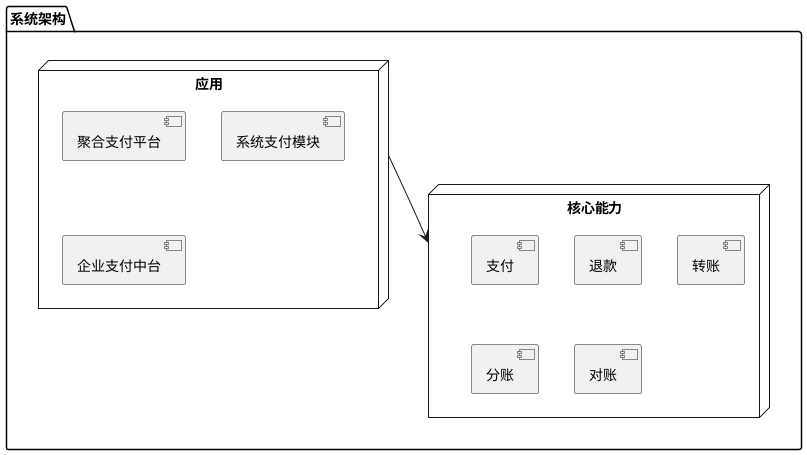
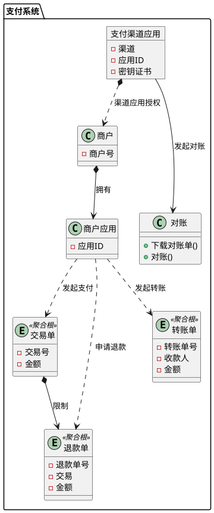

# 支付

## 概述

支付系统是一个用于处理各种支付和转账操作的核心平台，旨在为商户提供高效、安全、可靠的支付解决方案。该系统支持多种支付渠道，并具备灵活的业务处理能力，以满足不同场景下的支付需求。

## 目标

- **通用的支付组件** 能为企业、应用提供支付能力的基础设施组件，支付快速的集成
- **支付渠道** 提供支付渠道的接入能力，支持接入主流的支付渠道，如微信、支付宝、银联等

## 统一语言表

- **`商户`** 表示在支付系统下创建的独立权限的用户
- **`商户应用`** 表示商户创建的应用
- **`渠道应用`** 指在支付渠道下一个商户创建的一个支付应用，主要和支付渠道交互
- **`交易`** 表示商户发起的支付收单
- **`退款`** 表示支付渠道发起的支付收单
- **`转账`** 表示商户发起的使用支付渠道的商户余额向指定收款人、金额的转账
- **`支付渠道`** 表示支付系统的支付渠道，如各大银行、微信、支付宝、银联、翼支付等,支付渠道有收单和退款能力
- **`支付方式`** 表示支付渠道支持的支付方式，如微信、支付宝、银行卡等
- **`支付场景`** 用户在支付流程中使用的支付场景，如何APP、PC、小程序、H5、APP-NATIVE等
- **`支付路由`** 是指用户在发起支付是，支付系统根据用户选择的支付场景，选择合适的支付渠道和支付方式，最终发起支付请求
- **`对账`** 是指支付系统对支付渠道发起的支付请求，支付渠道返回的支付结果，支付系统对支付结果的处理，最终对账

### 系统架构

### 领域划分
#### 核心域

- 交易
- 退款
- 转账

### 核心模型

### 边界上下文

