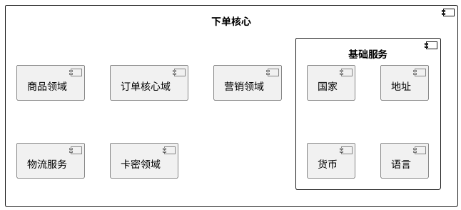

# 下单核心服务

## 依赖组件



- 商品领域
- 物流领域
- 订单领域
- 营销领域
- 基础服务
  - 国家
  - 地址
  - 货币
  - 税率


## 核心功能

- 订单金额计算
  - 商品服务获，取商品单价
  > 影响单价的因素有 商品、规格、数量、渠道、门店、区域、时间、会员等
  - 对接营销服务，获取商品优惠金额
  > 影响优惠金额的因素有 类目、商品、规格、数量、单价、渠道、门店、区域、时间、会员等，基本上和下单相关产生
  - 对接物流服务，获取订单的运费

- 订单下单


## 核心流程

```plantuml
<!--@include: ./核心流程.puml-->

```


